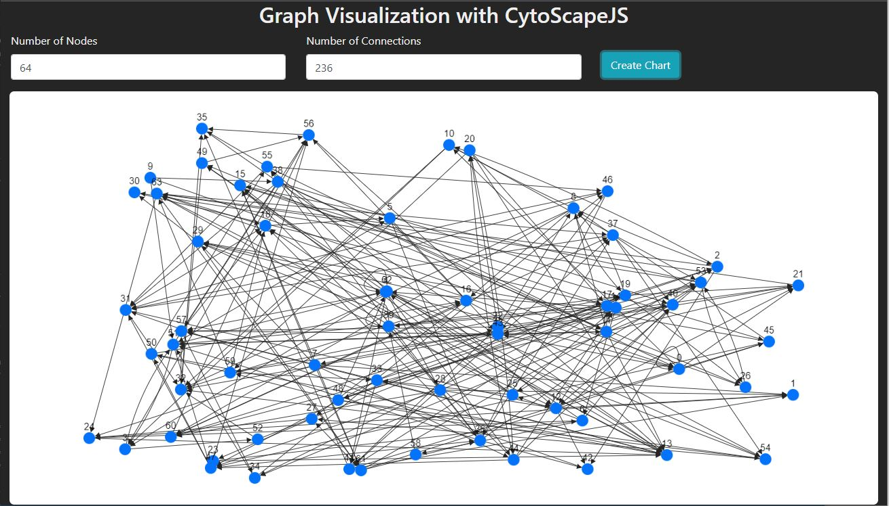

# Directed Graph Visualization Generator

{

The directed graph generator uses CytoScapeJS to create a directed graph visualization of nodes (Circles) and edges (Lines). Based on user input we can generate an almost infinite number of charts filled with nodes and their connections.

View the app here on [Github Pages](https://unionindesign.github.io/cytoscape-directed-graph/)

While this this a simple example...more coming soon with a more interesting data set 👍👍👍
